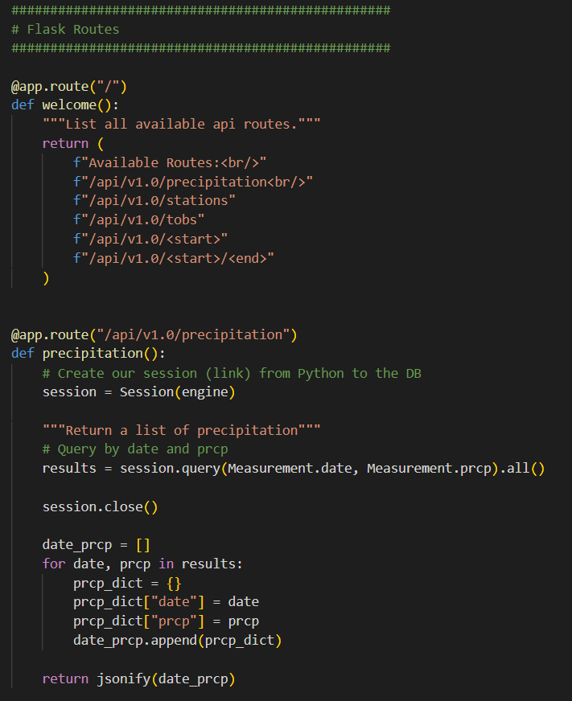
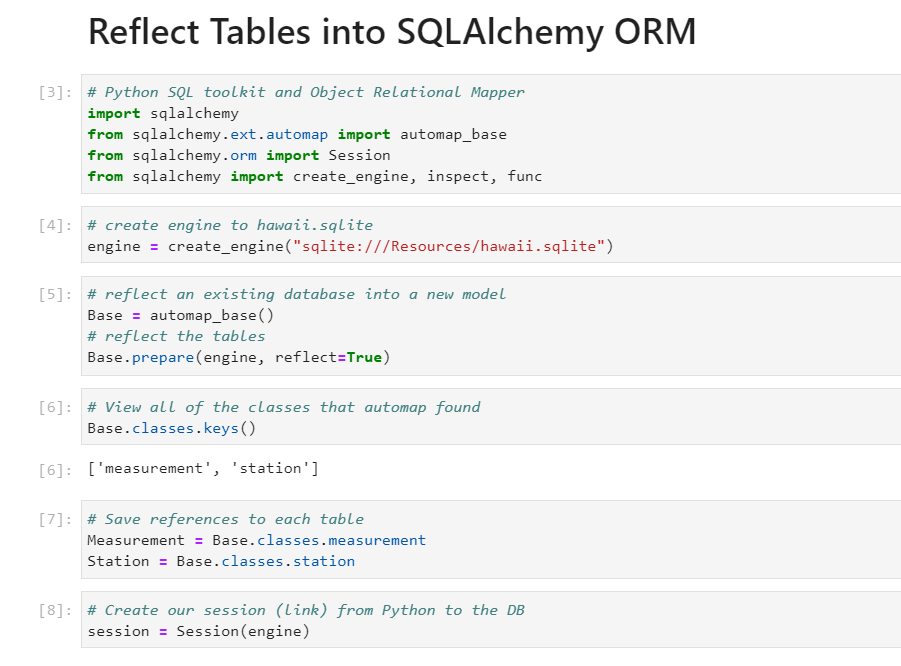
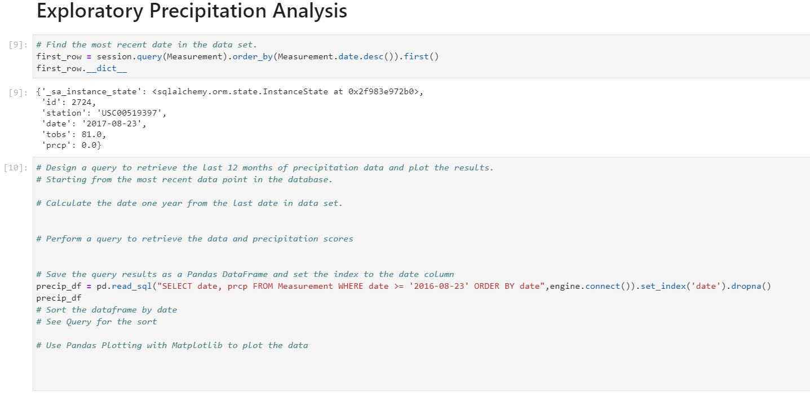

# SQLAlchemy Challenge
# Climate Analysis
## By Michael Thomas

The goal of this project was to explore the given weather and climate DB with SQLAlchemy ORM and Flask Python.

Flask Python was used to query the data. 
Pandas was used to query the DB and display charts. 

## DATA
All my data comes from a given set of CSV information that was imported into a SQLite DB:
- hawaii_measurements	
  - station	
  - date	
  - prcp (precipitation)
  - tobs (temperature observation)
- hawaii_stations
  - station
  - name	
  - latitude	
  - longitude
  - elevation

## Plotly
Once I reflected the information from the DB into Pandas I used plotly to create charts and analysis.

